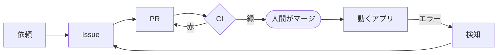
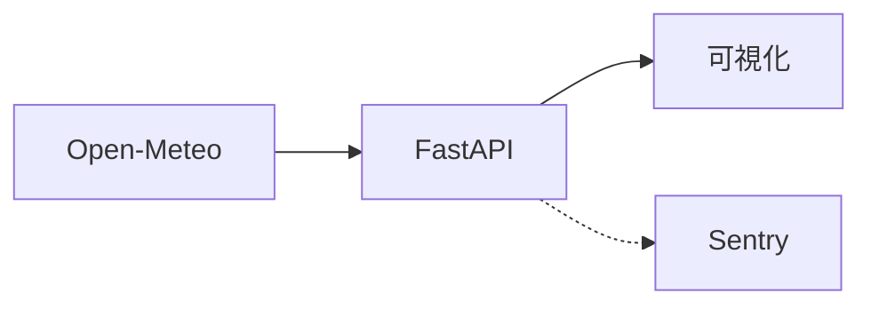

# loop-engineering-lab

天気データを取得・可視化する Web アプリを題材に、
**「壊れる → 自動で検知 → Issue 起票 → 修正 PR 作成 → CI 確認」までを無人で回す**
Loop Engineering の実証リポジトリ。

**人間がやるのは、朝イチのレビューとマージだけ。** それ以外は自動で回ることを目指す。

> このリポジトリの主役は天気データそのものではなく、**無人で回り続ける改良ループ自体**。
> 題材（天気）は「安定して毎日取得できて、可視化しやすい」という理由で選んだ、いわば的。

## ループ



依頼は Slack から、エラーは Sentry から入る。
**人間が触れるのは、マージの一点だけ。**

## アプリ

ループを回すための的。天気データを取得して返す。



## 技術構成

| 層 | 技術 | 状態 |
|---|---|---|
| API | FastAPI | 稼働 |
| 実行基盤 | AWS Lambda + API Gateway | 稼働 |
| IaC | Terraform | 稼働 |
| 監視 | Sentry | 稼働 |
| CI | GitHub Actions（ruff / pytest） | 稼働 |
| 依頼の入口 | Slack | 整形部のみ |
| DB | MySQL（RDS） | 未着手 |
| フロント | React + Recharts / D3.js | 未着手 |

DB とフロントは、必要になった段階で足す。

## 進め方のルール

- `main` への直接 push は禁止。すべて **Issue 起点 → ブランチ → PR → CI 確認 → セルフレビュー → 人間がレビュー・マージ** の順で進める
- **承認とマージは常に人間が行う**（自動化しない一線）
- **肉付け（機能追加・改善）は日々の Loop に任せ、まず「ループが一周する骨格」を通すことを優先する**
- 小さく段階を踏んで作る。空箱のディレクトリは並べず、各要素に着手する時点で作る

## IaC の置き場所の方針

- **この Lab では IaC をリポジトリ内（`infra/`）に同居させる。** 技術証明が目的で、
  「1 リポジトリを覗けばアプリ・インフラ・ループの全体像が一目で分かる」ことを優先するため
- **将来のビジネス本番では、IaC を専用リポジトリに切り出す。** 運用規模が大きくなると、
  管理性・権限分離・レビュー体制の面でインフラを独立させた方が良いため（実務の王道）
- この「小規模＝同居 / 本番規模＝分離」という使い分け自体が、インフラ設計の判断力の証明になる

## 骨格を通す順序

1. ~~器（README・.gitignore・最小アプリ・CI）~~
2. ~~最小アプリをデプロイする IaC（`infra/`）~~
3. カオス注入 → 検知 → Issue → PR → CI の Loop を一周させる ← いまここ
4. スケジューリングして無人で毎日回す

## 現状

**ループは一周した。ただし各ステップを人間が手で叩いている。**

Slack の依頼を Issue にし、実装 PR を出して CI 緑まで通す経路は実データで確認済み。
Sentry がエラーを受け取ることも確認済み。残るのは、これらを繋いで無人で回すこと。

無人化に必要なもの:

- **Slack Bot アプリ** — 現状は人間の権限で読んでいるため、無人では動かない
- **カオス注入** — 壊す仕組みそのもの
- **スケジューリング** — 定期実行

## デプロイ

```bash
./scripts/build_lambda.sh
cd infra && terraform apply
```

詳細は [`infra/README.md`](infra/README.md)。
