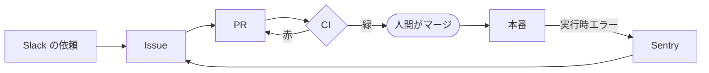
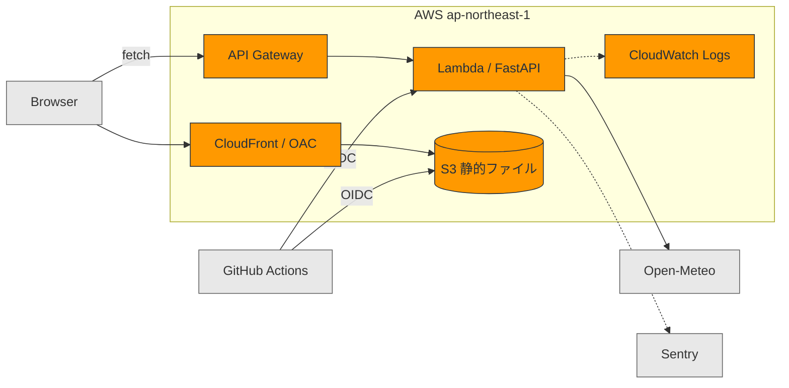

# loop-engineering-lab

**依頼から実装、障害から修復までを無人で回す。人間はレビューとマージだけ。**

デモ: https://d10o14tv6y0g4t.cloudfront.net

天気 API を題材に、Claude Code のクラウドルーチンが毎朝ループを一周させる。

## ループ



毎朝 05:00 JST、ルーチンが順に処理する。

1. **Sentry** を見る。壊れていれば修正 Issue と PR を作る
2. **Slack** を読む。依頼か雑談かを判断し、あいまいなら質問を返す
3. 依頼を構造化した Issue にし、実装して PR を出す
4. CI が緑になるまで見届ける

**承認とマージは自動化しない。** そこが人間の仕事。

04:30 に別のルーチンがデモ用の依頼を Slack へ投稿する（ネタは Open-Meteo の未使用パラメータ）。
実装 PR には約 1/3 の確率で、CI をすり抜けて実行時にだけ出るバグが混入する。
これが翌朝の修復対象になる。

定義は [`prompts/`](prompts/) にある。

## 構成



ブラウザは静的ファイルを CloudFront から取り、データは API Gateway を直接 fetch する。

| 層 | 技術 |
|---|---|
| 実行基盤 | Lambda + API Gateway（FastAPI を Mangum で載せる） |
| フロント配信 | S3 + CloudFront（OAC で S3 は非公開） |
| IaC | Terraform（state は S3。変更は手動 `apply`） |
| CI/CD | GitHub Actions。main マージで自動デプロイ（OIDC、鍵を置かない） |
| 監視 | Sentry |
| 自動化 | Claude Code のクラウドルーチン（[`prompts/`](prompts/)） |

題材は天気 API（Open-Meteo）。アプリのコードはループが実装する成果物で、
主題ではない。DB は未着手で、必要になった段階で足す。

## 設計方針

**取得と整形を分離する。** ネットワークに触るのは `fetch_*`、整形は純関数。
テストは整形側をスタブ入力で検証し、**外部 API を叩かない**。
CI の赤を「コードが壊れた」と読めるようにするため。

**CI の赤は検知シグナル。** 外部要因で赤くなると、その意味が失われる。

**インフラ変更は手動。** コードは毎日変わるがインフラは滅多に変わらず、
`apply` は作り替えを伴い得る。`plan` は人間が読む。

## 開発

```bash
python3 -m venv .venv && .venv/bin/pip install -r requirements-dev.txt
.venv/bin/ruff check . && .venv/bin/python -m pytest -q   # CI と同じ
```

フロントは [`frontend/`](frontend/)、デプロイ手順は [`infra/README.md`](infra/README.md)。
