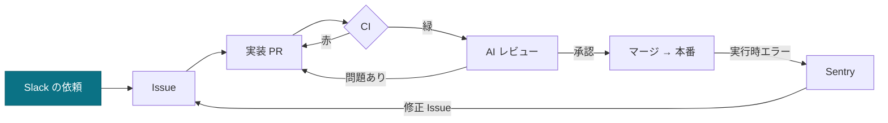
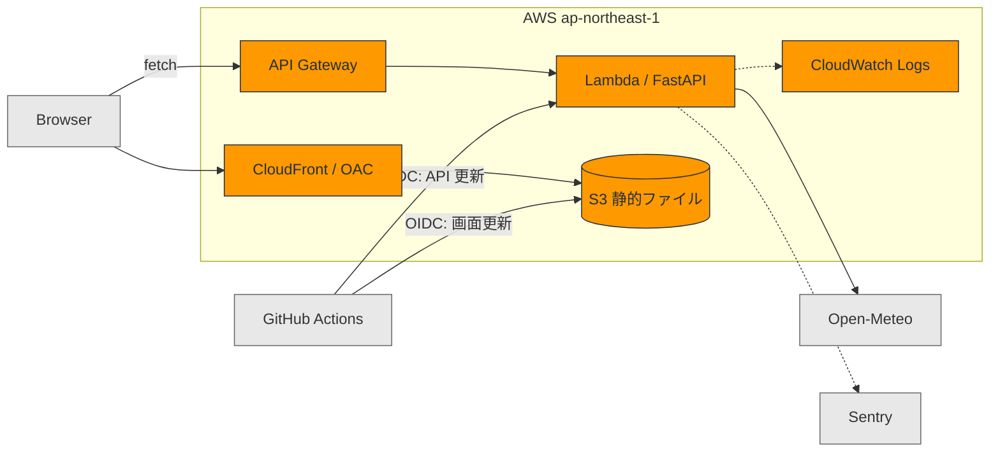

# loop-engineering-lab

Slack に依頼を書くと、翌朝には本番に出ている。その一周を AI だけで回す実験です。

デモ: https://d10o14tv6y0g4t.cloudfront.net

人間が手を動かすのは、最初の依頼を書くところだけ。


```mermaid
flowchart LR
    SLACK[Slack の依頼] --> ISSUE[Issue]
    ISSUE --> PR[実装 PR]
    PR --> CI{CI}
    CI -->|赤| PR
    CI -->|緑| REVIEW[AI レビュー]
    REVIEW -->|問題あり| PR
    REVIEW -->|承認| PROD[マージ → 本番]
    PROD -->|実行時エラー| SENTRY[Sentry]
    SENTRY -->|修正 Issue| ISSUE

    classDef human fill:#0b7285,stroke:#075c6b,color:#fff
    class SLACK human
```

依頼から本番反映まで、およそ 1 時間。上のデモも今朝このループが更新しました。

## 毎朝 3 つのルーチンが動く

| 時刻 | ルーチン | やること |
|---|---|---|
| 04:30 | 依頼生成 | デモ用の依頼を Slack に投稿する（本来は人がやる部分） |
| 05:00 | 朝のループ | Sentry 修復 → Slack 読解 → Issue 化 → 実装 → PR → CI 緑まで |
| 06:00 | レビュー | 差分をチェックし、問題がなければ承認してマージ |

作る側と見る側は別に動かしています。書いた本人が自分の PR を承認することはありません。
レビュー側は文脈を引き継がず、差分だけを読み直します。

### わざとバグを混ぜて、見抜けるか毎日試す

実装 PR には 3 回に 1 回くらい、わざとバグを混ぜます。
CI をすり抜け、本番で実際に動いて初めて表に出る種類のものです。

レビューが気づけばマージ前に差し戻し、見逃せば本番でエラーが起きて翌朝に直る。
どちらに転んでも、ループの中で閉じます。

| 混ぜたバグ | 検知 | 記録 |
|---|---|---|
| 北寄りの風向きで `/weather` が 500 になる | Sentry | [#43](../../issues/43) → [#44](../../pull/44) |
| 視程のキー名が違い `/weather` が 500 になる | Sentry | [#67](../../issues/67) → [#68](../../pull/68) |
| 日の出と日の入りの時刻が逆に表示される | レビュー | [#61](../../issues/61) → [#62](../../pull/62) |

上 2 つは 500 エラーになるので Sentry が拾います。
一方 3 つ目は例外を投げず、時刻が入れ替わったまま動いてしまうため Sentry には出ません。
差分を読んで気づくしかなく、これはレビューが見つけました。

### あいまいな依頼は、聞き返す

判断が割れる依頼は、推測で実装を始めず、選択肢を添えて聞き返します。


依頼は人間名義、返信は bot 名義でアカウントを分けています。
スレッドの最後が bot なら返事待ち、人間なら続報として翌朝のループが追います。

## 技術構成


```mermaid
flowchart LR
    BROWSER[Browser]
    subgraph AWS["AWS ap-northeast-1"]
        direction TB
        AGW[API Gateway] --> LAMBDA[Lambda / FastAPI]
        CF[CloudFront / OAC] --> S3[(S3 静的ファイル)]
        LAMBDA -.-> LOGS[CloudWatch Logs]
    end
    BROWSER -->|fetch| AGW
    BROWSER --> CF
    GHA[GitHub Actions] -->|OIDC: API 更新| LAMBDA
    GHA -->|OIDC: 画面更新| S3
    LAMBDA --> OM[Open-Meteo]
    LAMBDA -.-> SENTRY[Sentry]

    classDef aws fill:#ff9900,stroke:#232f3e,color:#232f3e
    classDef ext fill:#e8e8e8,stroke:#666,color:#333
    class AGW,LAMBDA,LOGS,CF,S3 aws
    class OM,SENTRY,GHA,BROWSER ext
```

| 役割 | 使っているもの |
|---|---|
| 実行基盤 | Lambda + API Gateway（FastAPI を Mangum で載せる） |
| フロント配信 | S3 + CloudFront（OAC で S3 は非公開） |
| IaC | Terraform（state は S3。変更は手動 `apply`） |
| CI/CD | GitHub Actions。main マージで自動デプロイ（OIDC、鍵を置かない） |
| 監視 | Sentry |
| 自動化 | Claude Code のクラウドルーチン（[`prompts/`](prompts/)） |

**常時稼働するサーバーは置いていません。** EC2・RDS・NAT Gateway は使わず、
ECS / Fargate も見送りました。1 日 1 回のループと個人利用のデモという負荷に対して、
コンテナやインスタンスを 24 時間動かし続ける必要がないためです。DB も同じ理由で未着手。

全体を**無料枠の範囲**に収める前提で、月 $1 の予算アラートを置いています
（無料枠内なら $0 のはずで、超えたら何かがおかしい、という閾値）。

天気アプリはループが実装した成果物であって主題ではありません。
ループの定義は [`prompts/`](prompts/) にあります。

## ループを成立させている設計判断

**CI の赤は、コードが壊れたときだけ起きるようにする。**
外部要因で赤くなると、AI が「自分の変更が壊した」と読み違えるため、
テストは外部 API を叩きません。

代わりに、実 API の応答を記録したものを [`tests/fixtures/`](tests/fixtures/) に置いています。
手書きのスタブだけだと、実装がキー名を間違えたときスタブも同じ間違いになり、
テストが緑のまま本番で `KeyError` になります（#164 が実際にそうでした）。
記録した実応答となら同じ誤りを共有できないので、CI の段階で止まります。
更新するときは `fetch_forecast()` / `fetch_hourly_series()` の戻り値をそのまま書き出します。

**インフラ変更は人間が承認する。** `apply` は作り替えを伴い得るため、ここは自動化していません。

## 開発

```bash
python3 -m venv .venv && .venv/bin/pip install -r requirements-dev.txt
.venv/bin/ruff check . && .venv/bin/python -m pytest -q   # CI と同じ
```

フロントは [`frontend/`](frontend/)、デプロイ手順は [`infra/README.md`](infra/README.md)。
