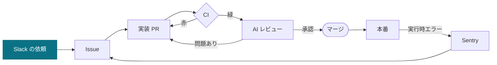
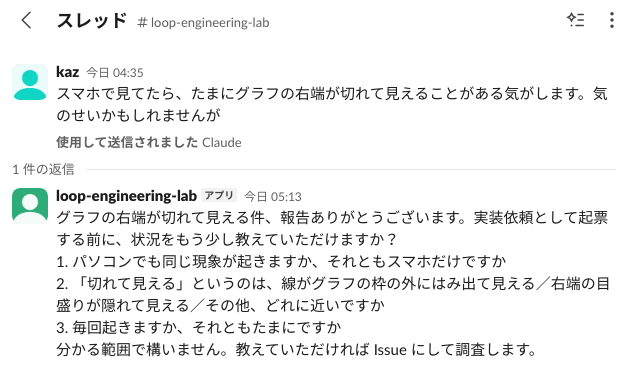
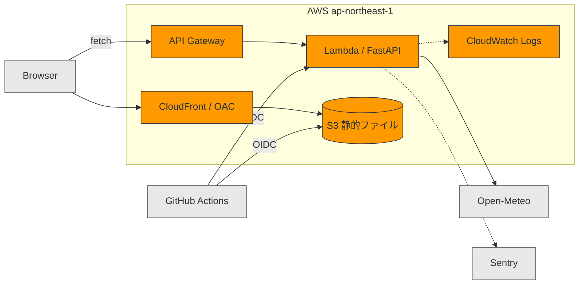

# loop-engineering-lab

**Slack の一言から本番デプロイまで、AI が無人で回す開発ループ。**

デモ: https://d10o14tv6y0g4t.cloudfront.net

「今日一日でどれくらい雨降ったか、合計の降水量も知りたいです」——Slack にそう書くだけでいい。
翌朝には仕様に整理された Issue が立ち、実装され、テストが書かれ、レビューされ、
本番に出ている。**人間が触るのは、最初の一言だけ。**

## 何が起きているか


```mermaid
flowchart LR
    SLACK[Slack の依頼] --> ISSUE[Issue]
    ISSUE --> PR[実装 PR]
    PR --> CI{CI}
    CI -->|赤| PR
    CI -->|緑| REVIEW[AI レビュー]
    REVIEW -->|問題あり| PR
    REVIEW -->|承認| MERGE([マージ])
    MERGE --> PROD[本番]
    PROD -->|実行時エラー| SENTRY[Sentry]
    SENTRY --> ISSUE

    classDef human fill:#0b7285,stroke:#075c6b,color:#fff
    class SLACK human
```

要件定義・実装・テスト・レビュー・マージ・デプロイ・障害対応。
開発サイクルの全工程が、人手を介さず一周する。

依頼から本番反映まで約 1 時間。上のデモは、今朝もこのループが更新した。

## 3 つの自律ルーチンで回す

| 時刻 | ルーチン | 役割 |
|---|---|---|
| 04:30 | 依頼生成 | デモ用の依頼を Slack に投稿する（実運用では人間の役割） |
| 05:00 | 朝のループ | Sentry 修復 → Slack 読解 → Issue 化 → 実装 → PR → CI 緑まで |
| 06:00 | レビュー | 差分を批判的に読み、問題が無ければ承認してマージ |

**作る側と見る側を、別の主体に分けている。** 実装したルーチンは自分の PR をマージしない。
レビュー担当が別セッション・別コンテキストで差分を読み直し、問題があれば差し戻す。

### 「見抜けるか」を毎日試している

このデモでは、実装 PR に**約 1/3 の確率で意図的にバグを混入させている**。
それも CI をすり抜け、実行時にだけ表面化する種類のものを。

レビュー役が見抜けば、その場で差し戻される。
見逃せば本番で例外が起き、Sentry が捕まえ、翌朝のループが修正 PR を出す。
**どちらに転んでも、ループの中で閉じる。** 実際に日の出・日の入りの入れ替わり（#61）、
視程のキー名誤り（#67）、風向の境界値 IndexError（#43）などが、この経路で検知・修復されている。

### あいまいな依頼は、聞き返す

曖昧な報告に、勝手な解釈で実装を始めない。
判断が割れる依頼には Slack のスレッドに**選択肢を添えて質問を返し**、返答を待ってから着手する。



実際のやり取り。「たまにグラフの右端が切れて見える気がします」という曖昧な報告に対し、
再現環境・症状の種類・再現頻度の 3 点を、**選択肢の形にして**聞き返している。
推測で Issue を立てれば、的外れな実装が本番まで通ってしまう。

役割も分離している。**依頼は人間名義、返信は bot 名義**
（GitHub Actions の `slack-reply` ワークフロー経由）。
スレッドの最終投稿が bot なら返事待ち、人間なら続報として翌朝のループが追う。

## 技術構成


```mermaid
flowchart LR
    subgraph AWS["AWS ap-northeast-1"]
        AGW[API Gateway] --> LAMBDA[Lambda / FastAPI]
        LAMBDA -.-> LOGS[CloudWatch Logs]
        CF[CloudFront / OAC] --> S3[(S3 静的ファイル)]
    end
    BROWSER[Browser] --> CF
    BROWSER -->|fetch| AGW
    LAMBDA --> OM[Open-Meteo]
    LAMBDA -.-> SENTRY[Sentry]
    GHA[GitHub Actions] -->|OIDC| LAMBDA
    GHA -->|OIDC| S3

    classDef aws fill:#ff9900,stroke:#232f3e,color:#232f3e
    classDef ext fill:#e8e8e8,stroke:#666,color:#333
    class AGW,LAMBDA,LOGS,CF,S3 aws
    class OM,SENTRY,GHA,BROWSER ext
```

ブラウザは静的ファイルを CloudFront から取り、データは API Gateway を直接 fetch する。

| 層 | 技術 |
|---|---|
| 実行基盤 | Lambda + API Gateway（FastAPI を Mangum で載せる） |
| フロント配信 | S3 + CloudFront（OAC で S3 は非公開） |
| IaC | Terraform（state は S3。変更は手動 `apply`） |
| CI/CD | GitHub Actions。main マージで自動デプロイ（OIDC、鍵を置かない） |
| 監視 | Sentry |
| 自動化 | Claude Code のクラウドルーチン（[`prompts/`](prompts/)） |

題材は天気 API（Open-Meteo）。アプリのコードはループが実装した成果物であって、主題ではない。
ループの定義そのものは [`prompts/`](prompts/) に置いてあり、差分としてレビューできる。

## ループを成立させている設計判断

**CI の赤は、コードが壊れたときだけ起きるようにしてある。** 外部要因で赤くなると
AI が「自分の変更が壊した」と読み違えるため。ネットワークに触るのは `fetch_*` に閉じ込め、
テストは整形側の純関数をスタブ入力で検証する（外部 API を叩かない）。

**インフラ変更は人間が承認する。** `apply` は作り替えを伴い得るので `plan` は人間が読む。
自動化する範囲としない範囲を、意図的に線引きしている。

## 開発

```bash
python3 -m venv .venv && .venv/bin/pip install -r requirements-dev.txt
.venv/bin/ruff check . && .venv/bin/python -m pytest -q   # CI と同じ
```

フロントは [`frontend/`](frontend/)、デプロイ手順は [`infra/README.md`](infra/README.md)。
