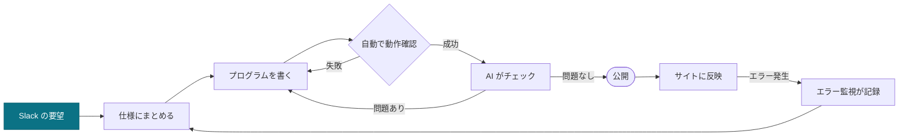
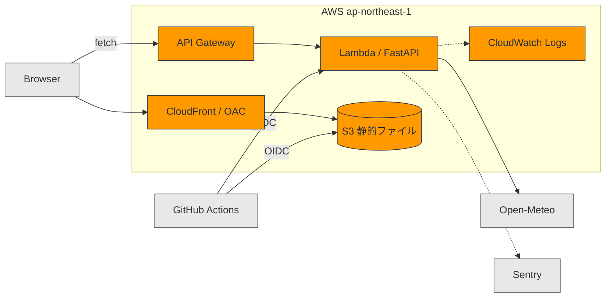

# loop-engineering-lab

Slack に要望を書くと、翌朝には機能が公開されている。その一連の流れを AI だけで回す実験です。

デモ: https://d10o14tv6y0g4t.cloudfront.net

たとえば「今日一日でどれくらい雨降ったか、合計の降水量も知りたいです」と Slack に書きます。
すると翌朝には、要望が仕様書にまとめられ、プログラムが書かれ、動作確認され、
別の担当がその内容をチェックしたうえで、公開されています。
人が手を動かすのは、最初に要望を書くところだけです。

## 全体の流れ


```mermaid
flowchart LR
    SLACK[Slack の要望] --> ISSUE[仕様にまとめる]
    ISSUE --> PR[プログラムを書く]
    PR --> CI{自動で動作確認}
    CI -->|失敗| PR
    CI -->|成功| REVIEW[AI がチェック]
    REVIEW -->|問題あり| PR
    REVIEW -->|問題なし| MERGE([公開])
    MERGE --> PROD[サイトに反映]
    PROD -->|エラー発生| SENTRY[エラー監視が記録]
    SENTRY --> ISSUE

    classDef human fill:#0b7285,stroke:#075c6b,color:#fff
    class SLACK human
```

要望を仕様にまとめ、プログラムを書き、動作を確認し、内容をチェックし、公開し、
不具合が出れば直す。この一通りを人手を介さずに一周します。
要望を書いてから公開されるまで、およそ 1 時間です。

上のデモサイトも、今朝この流れで更新されました。

## 毎朝 3 つの担当が動く

| 時刻 | 担当 | やること |
|---|---|---|
| 04:30 | 要望を出す役 | デモ用の要望を Slack に投稿する（本来は人がやる部分） |
| 05:00 | 作る役 | 不具合の修正、Slack の要望の読み取り、仕様書づくり、プログラムの作成 |
| 06:00 | 見る役 | 書かれたプログラムをチェックし、問題がなければ公開する |

作る役と見る役は、別々に動かしています。
プログラムを書いた本人が、自分の書いたものを「問題なし」と判断することはありません。
見る役はそれまでのやり取りを引き継がず、まっさらな状態でプログラムだけを読み直します。
気になる点があれば公開せず、作る役に差し戻します。

### わざと間違いを混ぜて、気づけるか毎日試す

作る役は、3 回に 1 回くらいの割合で、わざと間違いを混ぜたプログラムを書きます。
しかも自動の動作確認では見つからず、公開後に実際に使われて初めて表に出る種類の間違いです。

見る役が気づけば、公開前に差し戻されます。
見逃した場合はサイトでエラーが起き、それを監視の仕組みが記録して、翌朝に修正されます。
どちらに転んでも、この仕組みの中で直るようになっています。

実際に見つかって直った例です。それぞれ、報告と修正の記録が残っています。

| 混ぜた間違い | 気づいたきっかけ | 記録 |
|---|---|---|
| 北寄りの風向きのとき、サイトがエラーで表示できなくなる | エラー監視 | [報告 #43](../../issues/43) → [修正 #44](../../pull/44) |
| 見通しの距離を取り出す名前が違っていて、サイトがエラーになる | エラー監視 | [報告 #67](../../issues/67) → [修正 #68](../../pull/68) |
| 日の出と日の入りの時刻が、逆に表示されている | 見る役 | [報告 #61](../../issues/61) → [修正 #62](../../pull/62) |

上の 2 つはサイトがエラーで止まるので、監視の仕組みが自動で捕まえました。

3 つ目は少し性質が違います。日の出と日の入りが入れ替わっていても、
サイトはエラーを出さずに動いてしまいます。監視の仕組みには何も引っかかりません。
数字を見て「朝と夕方が逆だ」と気づくしかない種類の間違いで、これは見る役が見つけました。

### あいまいな要望は、聞き返す

はっきりしない要望を、勝手に解釈して作り始めることはしません。
どう受け取るか迷う場合は、Slack で聞き返し、返事を待ってから作り始めます。
このとき、答えやすいように選択肢を添えます。


実際のやり取りです。「たまにグラフの右端が切れて見える気がします」という報告に対して、
パソコンでも起きるのか、どう切れて見えるのか、毎回起きるのかを聞き返しています。
ここで推測のまま作り始めると、的外れなものが公開されてしまいます。

発言者も分けています。要望を書くのは人、返事をするのは AI で、
アカウントが別々に表示されます（上の画像で名前が違うのはそのためです）。
やり取りの最後が AI の発言なら返事待ち、人の発言なら追加の要望として翌朝に引き継ぎます。

## 技術構成


```mermaid
flowchart LR
    subgraph AWS["AWS ap-northeast-1"]
        AGW[API Gateway] --> LAMBDA[Lambda / FastAPI]
        LAMBDA -.-> LOGS[CloudWatch Logs]
        CF[CloudFront / OAC] --> S3[(S3 静的ファイル)]
    end
    BROWSER[Browser] --> CF
    BROWSER -->|fetch| AGW
    LAMBDA --> OM[Open-Meteo]
    LAMBDA -.-> SENTRY[Sentry]
    GHA[GitHub Actions] -->|OIDC| LAMBDA
    GHA -->|OIDC| S3

    classDef aws fill:#ff9900,stroke:#232f3e,color:#232f3e
    classDef ext fill:#e8e8e8,stroke:#666,color:#333
    class AGW,LAMBDA,LOGS,CF,S3 aws
    class OM,SENTRY,GHA,BROWSER ext
```

画面の見た目は CloudFront から配信し、天気のデータは API Gateway 経由で取得しています。

| 役割 | 使っているもの |
|---|---|
| 実行基盤 | Lambda + API Gateway（FastAPI を Mangum で載せる） |
| フロント配信 | S3 + CloudFront（OAC で S3 は非公開） |
| IaC | Terraform（state は S3。変更は手動 `apply`） |
| CI/CD | GitHub Actions。main マージで自動デプロイ（OIDC、鍵を置かない） |
| 監視 | Sentry |
| 自動化 | Claude Code のクラウドルーチン（[`prompts/`](prompts/)） |

題材は天気予報（Open-Meteo のデータを使っています）。
アプリそのものはこの仕組みが作った成果物であって、見せたいのは天気アプリではありません。
AI への指示文は [`prompts/`](prompts/) に置いてあり、変更の履歴も残ります。

## うまく回すために決めたこと

**動作確認が失敗するのは、プログラムが壊れているときだけにする。**
外部のサービスが一時的に不調で失敗すると、AI が「自分の書いたものが壊した」と勘違いします。
そこで動作確認では外部への通信を行わず、あらかじめ用意したデータで確かめるようにしています。

**サーバーの設定変更だけは人が承認する。** プログラムは毎日変わりますが、設定はめったに変わりません。
変更のしかたによってはサーバーが作り直しになることもあるため、ここは人が内容を確認してから反映します。
すべてを自動化するのではなく、任せる範囲と任せない範囲を分けています。

## 開発

```bash
python3 -m venv .venv && .venv/bin/pip install -r requirements-dev.txt
.venv/bin/ruff check . && .venv/bin/python -m pytest -q   # CI と同じ
```

フロントは [`frontend/`](frontend/)、デプロイ手順は [`infra/README.md`](infra/README.md)。
