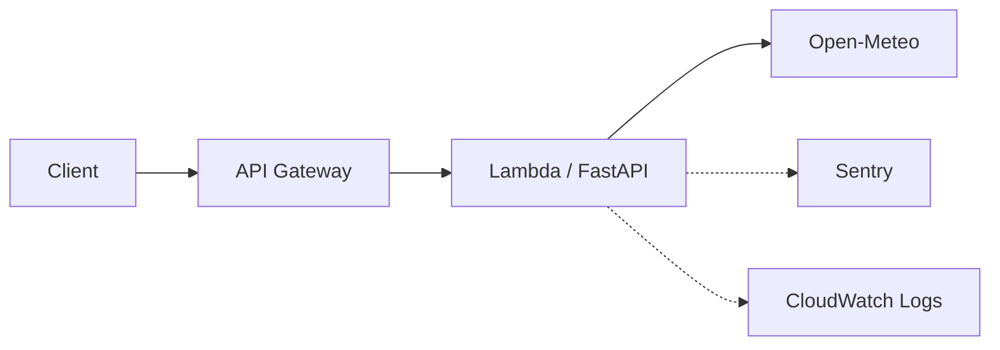

# infra

最小アプリのデプロイ先。Lambda + API Gateway のみ。



DB は使う段階で足す。今のアプリは DB を持たないため、
RDS を先に立てても無料枠を消費するだけになる。

## デプロイ

**アプリのコードは自動。** main にマージすると
[`deploy.yml`](../.github/workflows/deploy.yml) が Lambda を更新する。
認証は OIDC で、長期のアクセスキーは GitHub に置いていない。

**インフラの変更は手動。** コードは毎日変わるがインフラは滅多に変わらず、
`apply` は作り替えを伴い得るので、`plan` を目で見てから適用する。

```bash
./scripts/build_lambda.sh   # パッケージを作る（Linux 向けに依存を解決）
cd infra
terraform init
terraform plan              # 差分を確認してから
terraform apply
```

Sentry に送りたい場合は DSN を渡す:

```bash
terraform apply -var="sentry_dsn=https://...ingest.us.sentry.io/..."
```

DSN を省くと Sentry は初期化されない（アプリ側でそう分岐している）。

## 確認

```bash
curl "$(terraform output -raw api_url)/health"
curl "$(terraform output -raw api_url)/weather"
```

## tfstate について

**S3 backend。** bucket は `loop-engineering-lab-tfstate-417441750247`。

```
バージョニング  有効（誤って壊しても戻せる）
暗号化          AES256（state に sentry_dsn が平文で入るため）
パブリック      全ブロック
```

**bucket 自体は Terraform の管理外**（AWS CLI で作成）。同じ Terraform で
管理すると「state を置く場所を作るのに state が要る」という循環になるため。
一度作れば触らないので、これで足りる。

state ロック（DynamoDB）は入れていない。ソロ開発で同時実行が起きないため、
必要になった時点で足す。

## sentry_dsn の渡し方

**`terraform.tfvars` に置く。** これを忘れて `terraform apply` すると、
既定値の空文字が適用されて **本番の Sentry 送信が止まる**。

```bash
cp example.tfvars terraform.tfvars
# terraform.tfvars を編集して DSN を入れる
```

`terraform.tfvars` は `.gitignore` で除外済み。DSN は
https://hakusoft.sentry.io/settings/projects/loop-engineering-lab/keys/ で確認できる。

## 変数

| 変数 | 既定値 | 用途 |
|---|---|---|
| `region` | `ap-northeast-1` | デプロイ先 |
| `sentry_dsn` | `""` | 空なら Sentry を初期化しない |
| `sentry_environment` | `production` | 手元の検証(`local`)と分けるため |
| `log_retention_days` | `14` | 無期限だと無料枠を食う |
