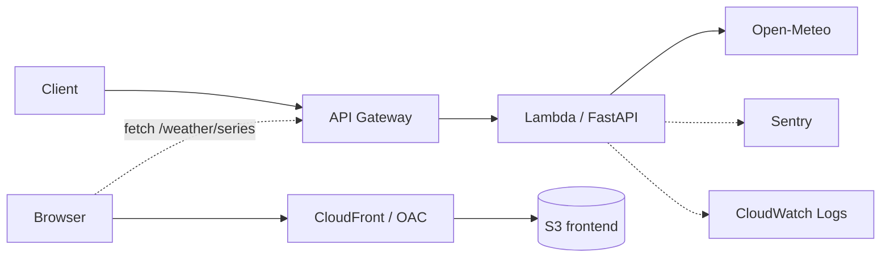

# infra

最小アプリのデプロイ先。Lambda + API Gateway のみ。



DB は使う段階で足す。今のアプリは DB を持たないため、
RDS を先に立てても無料枠を消費するだけになる。

フロント（`frontend.tf`）は S3 + CloudFront。S3 は直接公開せず、OAC 経由で
CloudFront からのみ読める。ブラウザは静的ファイルを CloudFront から取り、
データは API Gateway を直接 fetch する（CORS は `apigateway.tf` で許可）。

## デプロイ

**アプリのコードは自動。** main にマージすると
[`deploy.yml`](../.github/workflows/deploy.yml) が Lambda を更新する。
認証は OIDC で、長期のアクセスキーは GitHub に置いていない。

**インフラの変更は手動。** コードは毎日変わるがインフラは滅多に変わらず、
`apply` は作り替えを伴い得るので、`plan` を目で見てから適用する。

Lambda の**コード部分は Terraform の管理外**（`ignore_changes`）。
CI がビルドした zip と手元の zip はバイト単位で一致せず、管理させると
`apply` のたびに CI のデプロイを巻き戻してしまうため。
関数の設定（メモリ・タイムアウト・環境変数）は従来どおり Terraform が持つ。

```bash
./scripts/build_lambda.sh   # パッケージを作る（Linux 向けに依存を解決）
cd infra
terraform init
terraform plan              # 差分を確認してから
terraform apply
```

Sentry に送りたい場合は DSN を渡す:

```bash
terraform apply -var="sentry_dsn=https://...ingest.us.sentry.io/..."
```

DSN を省くと Sentry は初期化されない（アプリ側でそう分岐している）。

### フロントの初回配信

`terraform apply` で S3 バケットと CloudFront ができた後、初回だけ手で配信する
（以降は main マージで自動）。デモ URL を README に貼るのもこのタイミング。

```bash
cd frontend && npm ci && npm run build && cd ..
aws s3 sync frontend/dist "s3://$(terraform -chdir=infra output -raw frontend_bucket)" --delete
aws cloudfront create-invalidation \
  --distribution-id "$(terraform -chdir=infra output -raw frontend_distribution_id)" --paths '/*'
terraform -chdir=infra output -raw frontend_url   # この URL を README に貼る
```

CloudFront は配信開始まで数分かかる。すぐに 403 でも慌てず待つ。

## 確認

```bash
curl "$(terraform output -raw api_url)/health"
curl "$(terraform output -raw api_url)/weather"
```

## tfstate について

**S3 backend。** bucket は `loop-engineering-lab-tfstate-417441750247`。

```
バージョニング  有効（誤って壊しても戻せる）
暗号化          AES256（state に sentry_dsn が平文で入るため）
パブリック      全ブロック
```

**bucket 自体は Terraform の管理外**（AWS CLI で作成）。同じ Terraform で
管理すると「state を置く場所を作るのに state が要る」という循環になるため。
一度作れば触らないので、これで足りる。

state ロック（DynamoDB）は入れていない。ソロ開発で同時実行が起きないため、
必要になった時点で足す。

## sentry_dsn の渡し方

**`terraform.tfvars` に置く。** これを忘れて `terraform apply` すると、
既定値の空文字が適用されて **本番の Sentry 送信が止まる**。

```bash
cp example.tfvars terraform.tfvars
# terraform.tfvars を編集して DSN を入れる
```

`terraform.tfvars` は `.gitignore` で除外済み。DSN は
https://hakusoft.sentry.io/settings/projects/loop-engineering-lab/keys/ で確認できる。

## 請求アラート

月 $1 を超えたらメールで通知する（`billing.tf`）。無料枠内なら $0 のはずなので、
超えたら何かおかしいという設計。実績と予測の両方で通知する。

**Budgets と請求メトリクスは us-east-1 にしかない**ので、そこだけ別プロバイダを宣言している。

`terraform apply` の後、**確認メールのリンクを踏むまで SNS の購読は有効にならない**。

```bash
aws sns list-subscriptions-by-topic --region us-east-1 \
  --topic-arn <topic-arn> --query 'Subscriptions[].SubscriptionArn'
# PendingConfirmation なら未確認
```

### 無料枠の期限

| サービス | 無料枠 | 期限 |
|---|---|---|
| Lambda | 月 100 万リクエスト・40 万 GB 秒 | 永年 |
| API Gateway | 月 100 万リクエスト | **12 ヶ月** |
| S3 | 5GB・GET 2 万/PUT 2千 | アカウントによる |
| CloudFront | 月 1TB 転送・1000 万リクエスト | 永年 |

**API Gateway は 12 ヶ月で切れる。** 2027-07 以降は課金対象になる。

## 変数

| 変数 | 既定値 | 用途 |
|---|---|---|
| `region` | `ap-northeast-1` | デプロイ先 |
| `sentry_dsn` | `""` | 空なら Sentry を初期化しない |
| `sentry_environment` | `production` | 手元の検証(`local`)と分けるため |
| `log_retention_days` | `14` | 無期限だと無料枠を食う |
| `billing_alert_email` | `kazuichi.hirano@gmail.com` | 請求アラートの通知先 |
| `monthly_budget_usd` | `1` | 月額の閾値（USD） |
