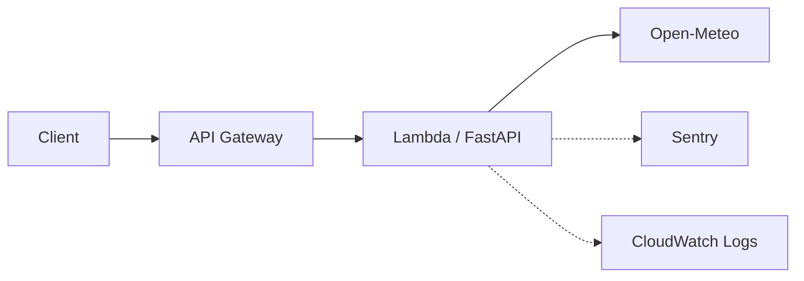

# infra

最小アプリのデプロイ先。Lambda + API Gateway のみ。



DB は使う段階で足す。今のアプリは DB を持たないため、
RDS を先に立てても無料枠を消費するだけになる。

## デプロイ

```bash
# 1. デプロイパッケージを作る（Linux 向けに依存を解決する）
./scripts/build_lambda.sh

# 2. 適用
cd infra
terraform init
terraform apply
```

Sentry に送りたい場合は DSN を渡す:

```bash
terraform apply -var="sentry_dsn=https://...ingest.us.sentry.io/..."
```

DSN を省くと Sentry は初期化されない（アプリ側でそう分岐している）。

## 確認

```bash
curl "$(terraform output -raw api_url)/health"
curl "$(terraform output -raw api_url)/weather"
```

## tfstate について

**現状はローカル state。** 最初から S3 backend を組むと、
その bucket を作るのに Terraform が要るという鶏卵問題になるため、
まず動かしてから移す。`.gitignore` で `*.tfstate` は除外済み。

state には `sentry_dsn` が平文で入る。ローカル state のうちは許容し、
S3 backend に移す際に暗号化する。

## 変数

| 変数 | 既定値 | 用途 |
|---|---|---|
| `region` | `ap-northeast-1` | デプロイ先 |
| `sentry_dsn` | `""` | 空なら Sentry を初期化しない |
| `sentry_environment` | `production` | 手元の検証(`local`)と分けるため |
| `log_retention_days` | `14` | 無期限だと無料枠を食う |
